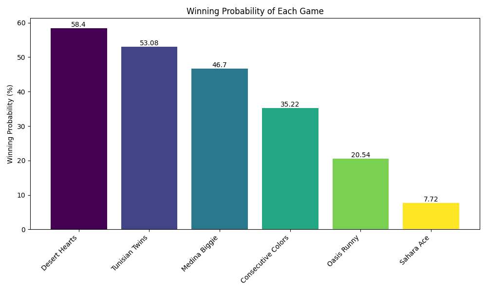
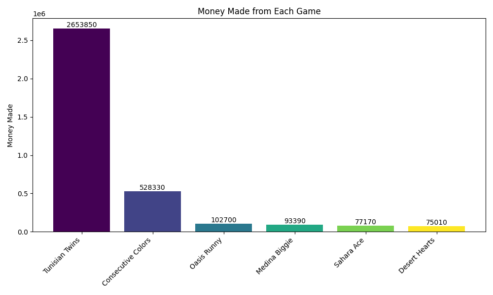

# Monte Carlo Simulation Games

This repository contains Monte Carlo simulations for various card games. The simulations are designed to provide statistical insights into the probability of winning, rounds won, and player score for each game.

## Statistical Output

The statistical output includes the probability of winning, rounds won, and player score for each game. The numbers are based on 100,000 simulations and a `fixed seed of 619`.

| Game               | Probability | Rounds Won | Money Made   |
| ------------------ | ----------- | ---------- | ------- |
| Sahara Ace         | 7.72%       | 7717       | 77,170   |
| Tunisian Twins     | 53.08%      | 53077      | 2,653,850 |
| Medina Biggie      | 46.70%      | 46695      | 93,390   |
| Desert Hearts      | 58.40%      | 58405      | 75,010      |
| Oasis Runny        | 20.54%      | 20540      | 102,700  |
| Consecutive Colors | 35.22%      | 35222      | 528,330  |


## Most Winnable Game

**Desert Hearts** is the most winnable game with a probability of 58.40%.



## Least Winnable Game

**Sahara Ace** is the least winnable game with a probability of 7.72%.

## Most Money-Making Game

**Tunisian Twins** is the most money-making game with a score of 2,653,850 TD.



## User Manual

1. **Running Simulations**
    - Ensure you have Python installed.
    - Run the script with the desired number of simulations (default : 100,000).
    - For a single deck game, set the number_of_simulation to 1.


    - Example 
  
    ```bash
    python main.py 100000
    ```

2. **Understanding Output**
    - Probability: The likelihood/chance of winning the game.
    - Rounds Won: The number of rounds won during simulations.
    - Score: The total score or money earned.

3. **Game Strategies**
    - Each game has its unique rules and winning conditions provided in the documentation.
    - Read the game descriptions in the script to understand the rules.
    - For the sixth and final game, the doumentation is provided within a docstring.

4. **Adjusting Simulations**
    - You can modify the `number_of_simulations` variable to adjust the number of simulations.
    - default value for `number of simulations` is 100000

---
